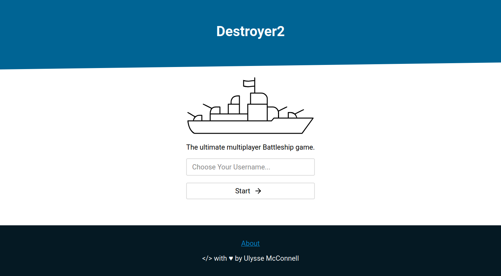

<br/>
<div id="logo" align="center">
    <br />
    
    <h3>Battleship Game</h3>
    <p>A real-time multiplayer battleship game</p>
</div>

<div style='margin:0 auto;width:80%;box-shadow: 0 0 16px #ddd'>



</div>

## Table of Contents

-   [Getting Started](#getting-started)
    -   [Prerequisites](#prerequisites)
    -   [Installing](#installing)
    -   [Customizing](#customizing)
-   [Deployment](#deployment)
-   [Docs](#docs)
-   [Built With](#built-with)
-   [Contributing](#contributing)
-   [Versioning](#versioning)
-   [Authors](#authors)
-   [License](#license)
-   [Acknowledgments](#acknowledgments)

## Getting Started

These instructions will get you a copy of the project up and running on your
local machine for development and testing purposes. See deployment for notes on
how to deploy the project on a live system.

### Prerequisites

You will need Redis and Node.js with npm installed on your machine to get
started (visit https://redis.io/download and https://nodejs.org to
install Redis and Node.js with npm).

### Installing

A step by step series of examples that tell you how to get a development
environment running:

Clone the git repository

```bash
git clone https://github.com/umcconnell/destroyer2.git
```

And install npm dependencies

```bash
npm install
```

Finally, start the Redis server.
You may optionally specify a Redis configuration file as argument to
`redis-server`

```bash
cd ./db/
redis-server
# or redis-server ./redis.conf
```

And start the webserver

```bash
npm run debug
```

Navigate to http://localhost:8080 to get started!

### Customizing

You can customize the project by adding a `.env` file in the root of the project
and a Redis configuration file in the `db/` folder. Make sure to specify the
Redis configuration file when starting the Redis server.

See the example [.env configuration](./.env.example) file and the
[guide](https://umcconnell.github.io/destroyer2/guide) for more information.

## Deployment

Change the database password in the [.env ](./.env.example) file and in the
[redis.conf](./db/redis.conf) file.
(see also:
[docs#customizing](https://umcconnell.github.io/destroyer2/guide/customizing))

Deploy the app to a free Heroku instance:

[](https://heroku.com/deploy)

## Docs

See the [docs](https://umcconnell.github.io/destroyer2/docs) for more
information about the system architecture, API endpoints, game events and
customization.

## Built With

-   [Node.js](https://nodejs.org/) - The server backend
-   [express](https://expressjs.com/) - The web server
-   [Redis](https://redis.io/) - The database
-   [node_redis](https://github.com/NodeRedis/node_redis) - The Redis
    client for Node.js
-   [ws](https://github.com/websockets/ws) - The WebSocket server

## Contributing

Please read [CONTRIBUTING.md](CONTRIBUTING.md) for details on our code of
conduct, and the process for submitting pull requests to us.

## Versioning

We use [SemVer](http://semver.org/) for versioning. For the versions available,
see the [tags on this repository](https://github.com/umcconnell/destroyer2/tags).

## Authors

Ulysse McConnell - [umcconnell](https://github.com/umcconnell/)

See also the list of
[contributors](https://github.com/umcconnell/destroyer2/contributors)
who participated in this project.

## License

This project is licensed under the MIT License - see the
[LICENSE.md](LICENSE.md) file for details.

## Acknowledgments

-   [Node.js](https://nodejs.org/) - The server backend
-   [express](https://expressjs.com/) - The web server
-   [@hapi/joi](https://hapi.dev/module/joi/) - Object validator for API
-   [jsonwebtoken](https://github.com/auth0/node-jsonwebtoken) - User auth
-   [Redis](https://redis.io/) - The database
-   [node_redis](https://github.com/NodeRedis/node_redis) - The Redis client for
    Node.js
-   [bluebird](http://bluebirdjs.com) - Promise library
-   [ws](https://github.com/websockets/ws) - The WebSocket server
-   [winston](https://github.com/winstonjs/winston) - The logging library
-   [morgan](https://github.com/expressjs/morgan) - The HTTP request logger
-   [dotenv](https://github.com/motdotla/dotenv) - The .env file parser
-   [module-alias](https://github.com/ilearnio/module-alias) - Custom module
    aliases
-   [feather](https://github.com/feathericons/feather) - The icons
-   [Warship icon by zidney on the NounProject (resized, minified and changed line thickness)](https://thenounproject.com/term/warship/1597472/) - The logo
-   Billie Thompson - [PurpleBooth](https://github.com/PurpleBooth) for the
    README and CONTRIBUTING template
-   [vuepress](https://vuepress.vuejs.org/) - The documentation generator
-   [Algolia DocSearch](https://docsearch.algolia.com/) - The documentation
    search provider
