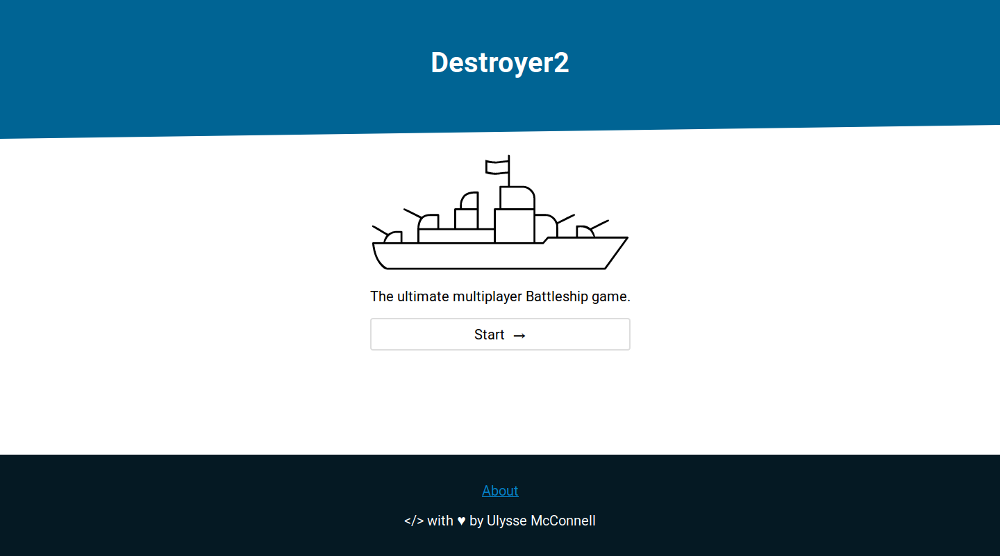
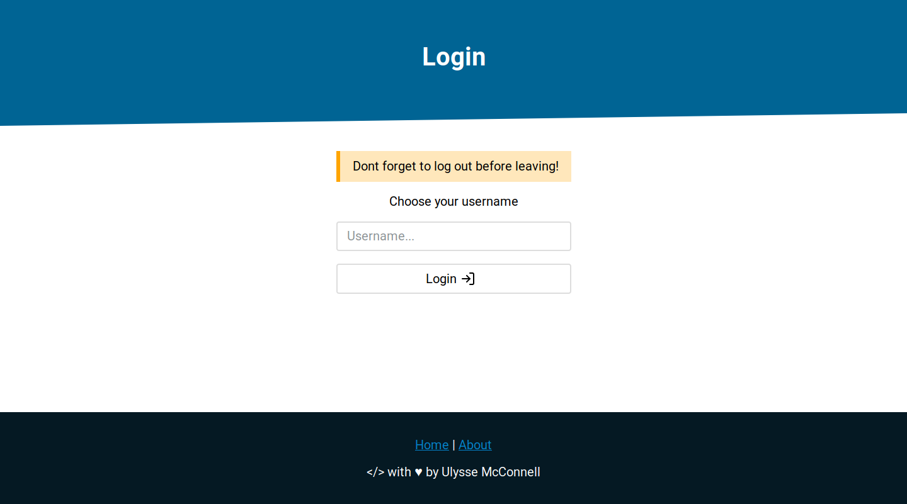
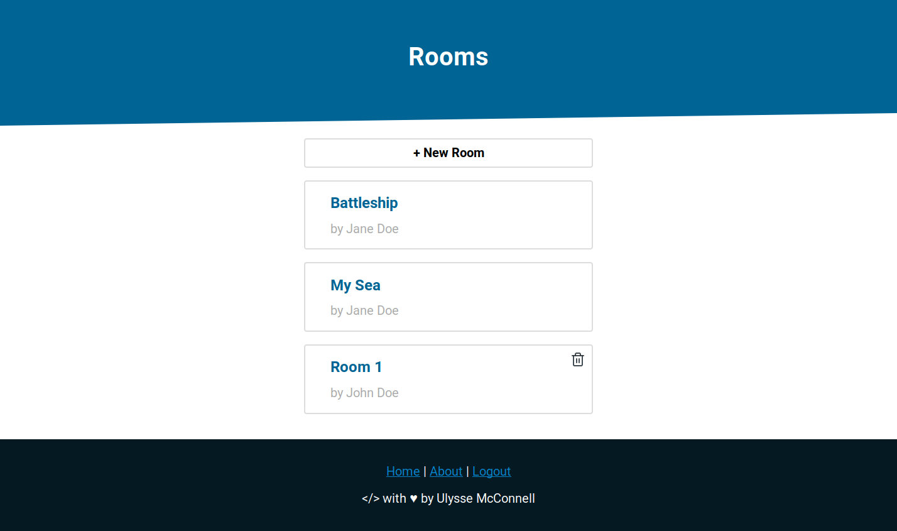
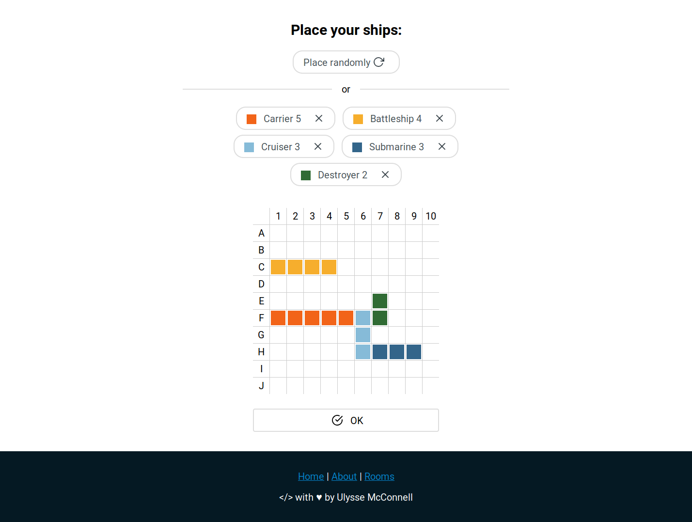
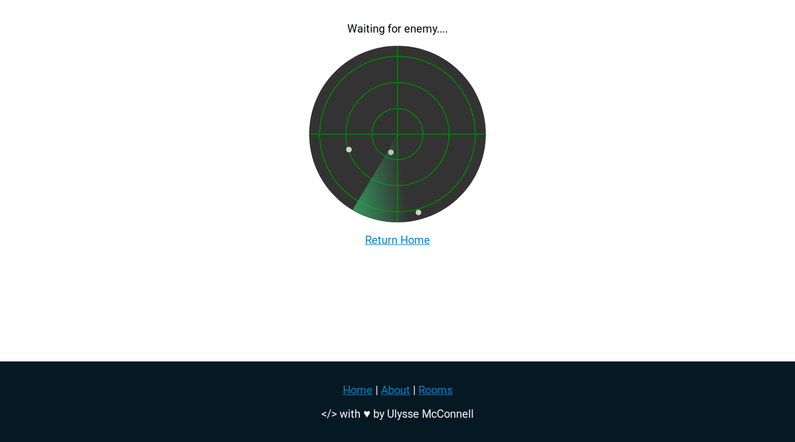

# Destroyer2

A real time multiplayer battleship game

## Table of Contents

-   [Getting Started](#getting-started)
    -   [Prerequisites](#prerequisites)
    -   [Installing](#installing)
    -   [Customizing](#customizing)
-   [Screenshots](#screenshots)
-   [Deployment](#deployment)
-   [Docs](#docs)
-   [Built With](#built-with)
-   [Contributing](#contributing)
-   [Versioning](#versioning)
-   [Authors](#authors)
-   [License](#license)
-   [Acknowledgments](#acknowledgments)

## Getting Started

These instructions will get you a copy of the project up and running on your
local machine for development and testing purposes. See deployment for notes on
how to deploy the project on a live system.

### Prerequisites

You will need redis and node with npm installed on your machine to get
started (visit https://redis.io/download and https://nodejs.org to
install redis and node with npm).

### Installing

A step by step series of examples that tell you how to get a development
environment running:

Clone the git repository

```bash
git clone https://github.com/umcconnell/destroyer2.git
```

And install npm dependencies

```bash
npm install
```

Finally, start the redis server.
You may optionally specify a redis configuration file as argument to
`redis-server`

```bash
cd ./db/
redis-server
# or redis-server ./redis.conf
```

And start the webserver

```bash
npm run debug
```

Navigate to http://localhost:8080 to get started!

### Customizing

You can customize the project by adding a `.env` file in the root of the project
and a redis configuration file in the `db/` folder. Make sure to specify the
redis configuration file when starting the redis server.

See the [docs](/docs/docs.md#customizing) for more information.

## Screenshots

Home screen:



Login Screen:



Rooms Screen:



Shippicker Screen:



Loader Screen:



## Deployment

Change the database password in the [.env ](.env) file and in the
[redis.conf](db/redis.conf) file.
(see also: [docs#customizing](/docs/docs.md#customizing))

## Docs

See the [docs](docs/docs.md) for more information about the system architecture,
API endpoints, game events and customization.

## Built With

-   [node](https://nodejs.org/) - The server backend
-   [express](https://expressjs.com/) - The web server
-   [redis](https://redis.io/) - The database
-   [node_redis](https://github.com/NodeRedis/node_redis) - The redis
    client for node
-   [ws](https://github.com/websockets/ws) - The WebSocket server

## Contributing

Please read [CONTRIBUTING.md](CONTRIBUTING.md) for details on our code of
conduct, and the process for submitting pull requests to us.

## Versioning

We use [SemVer](http://semver.org/) for versioning. For the versions available,
see the [tags on this repository](https://github.com/umcconnell/destroyer2/tags).

## Authors

Ulysse McConnell - [umcconnell](https://github.com/umcconnell/)

See also the list of
[contributors](https://github.com/umcconnell/destroyer2/contributors)
who participated in this project.

## License

This project is licensed under the MIT License - see the
[LICENSE.md](LICENSE.md) file for details.

## Acknowledgments

-   [node](https://nodejs.org/) - The server backend
-   [express](https://expressjs.com/) - The web server
-   [redis](https://redis.io/) - The database
-   [node_redis](https://github.com/NodeRedis/node_redis) - The redis client for
    node
-   [ws](https://github.com/websockets/ws) - The WebSocket server
-   [winston](https://github.com/winstonjs/winston) - The logging library
-   [feather](https://github.com/feathericons/feather) - The icons
-   [Warship icon by zidney on the NounProject (resized, minified and changed line thickness)](https://thenounproject.com/term/warship/1597472/) - The logo
-   Billie Thompson - [PurpleBooth](https://github.com/PurpleBooth) for the
    README and CONTRIBUTING template
